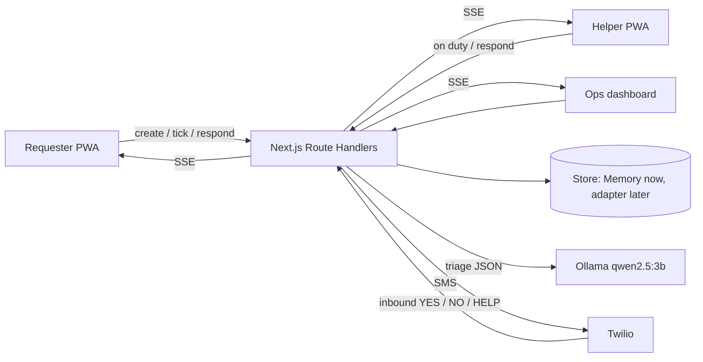

# ResQ — Uber for emergencies

> Skilled neighbours, dispatched in seconds. Built for Kraft Night (IEDC TKMCE) — Theme: **Cooperation**

This file is both the project README and the build specification handed to the coding agent. Sections 6–11 are written to be executed as-is.

ResQ turns a neighbourhood into a response network. Residents register the skills they already have — doctor, nurse, swimmer, boat owner, electrician, plumber, 4×4 driver, generator owner. When someone is in trouble they describe the problem (voice or text), the app triages it, shows them what to do *right now*, and dispatches the best-placed helpers Uber-style: the top three are pinged in parallel, the first to accept gets the job, and if nobody answers within 30 seconds the next wave goes out with a wider radius. When mobile data dies, the whole loop still works over SMS.

It complements 112. It does not replace it.

---

## 1. The problem

During the 2018 Kerala floods and the 2024 Wayanad landslides, official response systems were overwhelmed within hours. Most early rescues were done by neighbours — fishermen with boats, nurses next door, people who could swim — coordinated through chaotic WhatsApp groups where a plea for a boat scrolled past 200 messages.

The skills were always there. What was missing was **matching and dispatch**: who nearby can help with *this* problem, how do we reach them in seconds, and what does the person do while help is on the way?

## 2. Why this is "Cooperation"

- **Citizens ↔ citizens:** skills become a shared resource of the neighbourhood.
- **Citizens ↔ institutions:** a coordinator dashboard gives ward officers and NGOs a live picture of unmet needs, with escalation when the community can't cover a request.
- **Humans ↔ AI:** the AI never acts alone — it triages, suggests, and hands off to a human helper.

## 3. How it works

### Requester — no login
1. Opens the app, taps **Hold to speak** (browser Web Speech API) or types: *"Water is rising, my grandmother can't walk, ground floor, near Kadappakada."*
2. Triage returns `{ type: "evacuation_mobility", urgency: "critical", skills: ["boat_owner","swimmer","driver_4x4"] }`.
3. Screen shows a curated guidance card, a **Call 112** button, and live dispatch status: *"Pinging 3 helpers within 1 km… 0:27"*.
4. On acceptance: helper name, skill, distance, phone.

### Helper — phone number + OTP
1. Registers skills, then toggles **On duty** during an event (shares location while on duty).
2. Receives an incoming-request card in the app **and** an SMS: *"RESQ: person 400 m away needs a SWIMMER (flood, critical). Reply YES to accept, NO to skip. Expires in 30 s."*
3. Accepts in the app or by replying YES, gets a maps link, marks the job done, gets rated.

### Coordinator — `/ops`, password-gated
Live map of open requests, unmatched escalations, helper coverage by skill. Requests that survive four waves with no acceptance are flagged **Escalated**.

## 4. Triage: what the AI does and deliberately doesn't do

| Task | Done by | Why |
|---|---|---|
| Classify free text into need type, urgency, skills | **Ollama** `qwen2.5:3b`, `format: json`, temperature 0, 4 s timeout | Local, structured output only, no cloud AI |
| Fallback when the model is slow or confidence < 0.5 | Keyword rules in `lib/triage-rules.ts` + one fixed clarifying question | The demo never hangs |
| "What do I do right now?" | **Curated guidance cards** (Red Cross / WHO first aid) selected by type | An LLM must not improvise medical advice |
| Rank helpers | Weighted scoring formula (§5) | Explainable, tunable, no ML |

Triage output schema (validated by a hand-written type guard, no schema libraries):

```json
{
  "type": "flood_rescue | cardiac_no_breathing | bleeding | fracture | electrical | fire | trapped_structural | snakebite | evacuation_mobility | supplies_oxygen_meds | missing_person | other",
  "urgency": "critical | high | medium | low",
  "skills": ["doctor","nurse","first_aid","swimmer","boat_owner","electrician","plumber","driver_4x4","generator_owner","counselor","volunteer"],
  "summary": "one line",
  "confidence": 0.0
}
```

`lib/taxonomy.ts` holds the skill list and the default type → skills mapping; both Ollama's system prompt and the rules fallback read from it. Sample guidance card (`bleeding`): apply firm direct pressure with a clean cloth · keep pressing, don't peek · raise the limb if possible · do not remove embedded objects · call 112 if bleeding soaks through or the person is pale or drowsy.

## 5. Dispatch algorithm

```
candidates = onDuty helpers within radius(wave)          // 1 km, 2 km, 4 km, 8 km
score      = 0.45*skillMatch + 0.30*proximity + 0.15*reliability + 0.10*recency
             skillMatch  = |skillsNeeded ∩ helperSkills| / |skillsNeeded|
             proximity   = max(0, 1 - distance/radius)      // haversine
             reliability = rolling rating, starts 0.7
             recency     = 1 if lastSeen < 10 min else 0.5

each wave: ping top 3 not yet pinged (app event + SMS) → 30 s window
  first YES wins → store.acceptDispatch() is atomic: succeeds only if request.status == "searching",
                   then other pinged dispatches → "cancelled"
  all 3 reject   → next wave immediately (don't wait for the timer)
  timer expires  → dispatches → "expired", wave += 1, widen radius
after 4 waves    → request.status = "escalated" → ops flag + "Call 112 now" prompt
```

Waves are advanced by `POST /api/requests/:id/tick`, called by the requester's screen every 30 s. It is idempotent, so no long-running timers are needed.

## 6. Tech stack

### Allotted now — 70 / 100 credits

| Item | Credits | Role |
|---|---|---|
| **Next.js** (App Router) | 35 | One codebase: `/` requester, `/helper`, `/ops`, plus all backend logic in Route Handlers |
| **Ollama** | 20 | Local `qwen2.5:3b` for structured triage |
| **Tailwind CSS** | 10 | Three role UIs in one night |
| **Twilio** | 5 | SMS ping, YES/NO accept, requester updates, helper OTP login |
| **TypeScript** | 0 | Language; shared types in `lib/types.ts` |

### Data layer — pending (30 credits available)

Persistence sits behind one interface, `lib/store/index.ts`. Development starts on `MemoryStore` today; the purchased adapter is added later and swapping is one import. **Status: the Firebase bid was lost, so the demo runs on `MemoryStore` unless one of the fallbacks below is purchased.**

| Option | Credits | Adapter notes |
|---|---|---|
| **Firebase** — not obtained (bid lost) | 20 | `FirestoreStore` via `firebase-admin`; transaction for `acceptDispatch`; optional later swap of OTP login to Firebase Auth |
| **MongoDB** (first fallback) | 25 | `MongoStore` via `mongodb` driver; `2dsphere` index on helpers; `findOneAndUpdate` on `status:"searching"` for the accept |
| **PostgreSQL** | 25 | `PgStore` via `pg`; PostGIS `ST_DWithin`; `UPDATE … WHERE status='searching' RETURNING` |
| **Redis + Socket.IO** | 10 + 10 | `RedisStore`; `GEOSEARCH` for radius; Lua script for the accept; Socket.IO replaces SSE |

Nothing else on the list is worth buying: Socket.IO/Redis are redundant with SSE + Firestore, Prisma won't fit next to a DB, Material UI duplicates Tailwind.

### Identity (works with every data option)
- Requester: random UUID in `localStorage`, sent as `x-resq-uid` header. No login when you're in trouble.
- Helper: phone → `POST /api/auth/otp/send` (Twilio SMS, 6-digit, 5 min) → `POST /api/auth/otp/verify` → HMAC-signed session in an httpOnly cookie (Node `crypto`, `SESSION_SECRET`).
- Coordinator: `OPS_PASSWORD` env var gate on `/ops`.

### Realtime (works with every data option)
All mutations go through the API, which runs as **one Node process** on a laptop (Ollama already forces this). `lib/events.ts` is an in-process `EventEmitter`; Server-Sent Events routes forward its events to browsers: `/api/requests/:id/stream` (requester) and `/api/helpers/:id/stream` (helper, ops). Change streams / Firestore listeners are an optional upgrade, not a requirement.

## 7. Architecture



## 8. Data model (adapter-agnostic)

```
Helper    { id, name, phone, skills[], location{lat,lng}|null, onDuty, reliability, lastSeen }
Request   { id, requesterId, description, location{lat,lng}|null, channel: "app"|"sms",
            triage{type,urgency,skills[],summary,confidence,source:"ollama"|"rules"}|null,
            status: "triaging"|"searching"|"matched"|"resolved"|"escalated"|"cancelled",
            wave, radiusKm, matchedHelperId|null, createdAt, updatedAt }
Dispatch  { id, requestId, helperId, wave, score, channel: "app"|"sms",
            status: "pinged"|"accepted"|"rejected"|"expired"|"cancelled", pingedAt, respondedAt|null }
Rating    { id, requestId, helperId, stars, createdAt }
Otp       { phone, code, expiresAt }
```

Guidance cards and landmarks are static TypeScript (`lib/guidance.ts`, `lib/landmarks.ts`) so they can be reviewed in a PR. SMS-in requests (`HELP <text>`) have no GPS: if the text matches a landmark, dispatch runs normally; otherwise the request is created with `location: null` and flagged for the coordinator.

## 9. Repository layout

```
app/
  page.tsx                               requester flow
  helper/page.tsx                        skills onboarding, on-duty toggle, incoming card
  ops/page.tsx                           coordinator dashboard + SVG map
  api/triage/route.ts                    POST {text} → triage JSON
  api/auth/otp/send/route.ts             POST {phone}
  api/auth/otp/verify/route.ts           POST {phone, code} → session cookie
  api/helpers/route.ts                   POST upsert profile; PATCH on-duty + location
  api/helpers/[id]/stream/route.ts       SSE: pings, cancellations
  api/requests/route.ts                  POST create → triage → wave 1
  api/requests/[id]/route.ts             GET status (polling fallback)
  api/requests/[id]/tick/route.ts        POST advance wave / expire / escalate
  api/requests/[id]/stream/route.ts      SSE: dispatch status, match
  api/dispatches/[id]/respond/route.ts   POST {action: "accept"|"reject"}
  api/ops/requests/route.ts              GET open + escalated requests (password gated)
  api/twilio/inbound/route.ts            Twilio webhook: YES / NO / HELP <text>
lib/
  types.ts        taxonomy.ts    guidance.ts    landmarks.ts
  triage.ts       (Ollama, timeout, type guard)   triage-rules.ts (fallback)
  dispatch.ts     (score, selectWave, haversine)  events.ts (EventEmitter)
  sms.ts          (Twilio send + message templates)
  session.ts      (HMAC sign/verify)
  store/index.ts  (Store interface + getStore())  store/memory.ts   store/<adapter>.ts
scripts/seed.ts   30 helpers around SEED_CENTER with mixed skills
```

`Store` interface (implement exactly this; keep it small):

```ts
upsertHelper, getHelper, getOnDutyHelpers, setOnDuty,
createRequest, getRequest, updateRequest, listOpenRequests,
createDispatches, listDispatches(requestId), listPingedForHelper(helperId), updateDispatch,
acceptDispatch(dispatchId): Promise<{ok:true; request} | {ok:false; reason:"already_matched"|"expired"|"not_found"}>,
saveOtp, verifyOtp
```

## 10. Build rules for the coding agent

1. **Dependencies:** `next`, `react`, `react-dom`, `typescript`, `tailwindcss` (+ its PostCSS deps), `twilio`. Nothing else — no zod, no leaflet, no mongoose, no next-auth, no uuid (use `crypto.randomUUID()`). When a data layer is purchased, add only its official driver (`firebase-admin`, `mongodb`, `pg`, or `redis` + `socket.io`).
2. **Ollama is called only from Route Handlers**, never from the browser. Wrap in `AbortController` with a 4 s timeout; on timeout or invalid JSON, fall back to rules and set `triage.source = "rules"`.
3. **All persistence goes through `getStore()`.** Components never touch the store; they call API routes. `MemoryStore` is the default and must be complete enough to run the whole demo (seeded at boot from `scripts/seed.ts` data).
4. **Single-process assumption** is documented in `lib/events.ts`. Do not build multi-instance pub/sub.
5. **Waves are tick-driven** (§5). The only immediate transition is "all pinged in this wave rejected → start next wave now".
6. **Every route handler** validates input by hand and returns `{ error }` with a proper status. TypeScript `strict: true`.
7. **Map with zero libraries:** `/ops` renders an inline SVG — equirectangular projection around `SEED_CENTER`, rings at 1/2/4/8 km, helpers as dots coloured by skill, requests as pulsing markers. Swap to a map library only if organisers confirm unlisted packages are allowed.
8. **Mobile-first:** one-handed requester screen, ≥48 px touch targets, `tel:112` link always visible, dark mode via `prefers-color-scheme`.
9. **Guidance shown to users is static text** from `lib/guidance.ts`. LLM output is only used for classification and the one-line summary.
10. **Twilio trial** prefixes messages and only delivers to verified numbers; keep templates short and never depend on the prefix when parsing inbound replies (`YES`/`NO`/`HELP` are matched case-insensitively at the start of the body).

## 11. Milestones and acceptance checks

| # | Milestone | Done when |
|---|---|---|
| M0 | Scaffold | `npm run dev` serves `/`, `/helper`, `/ops` with Tailwind; `.env.example` complete; `ollama list` shows `qwen2.5:3b` |
| M1 | Triage | `curl -X POST localhost:3000/api/triage -d '{"text":"father collapsed not breathing"}'` returns schema-valid JSON in < 4 s with `type: "cardiac_no_breathing"`; unplugging Ollama returns `source: "rules"`; 11 guidance cards present |
| M2 | Store + dispatch | `POST /api/requests` creates the request, runs triage, creates 3 wave-1 dispatches; `tick` after 30 s expires them and creates wave 2 with a wider radius; two concurrent `accept` calls → exactly one `ok: true`; 4 empty waves → `escalated` |
| M3 | Realtime | Requester screen updates via SSE without refresh; helper screen shows the incoming card within 1 s of ping; cancelled dispatches disappear on the losing helper's screen |
| M4 | Twilio | Ping SMS sent on each dispatch; inbound `YES` accepts, `NO` rejects, `HELP trapped near hostel` creates a flagged request; OTP login issues a session cookie |
| M5 | UI complete | Three screens finished; SVG map on `/ops` shows seeded helpers and live requests; Lighthouse mobile usability ≥ 90 |
| M6 | Demo | `npm run seed` places 30 helpers; §13 script runs end to end on two phones; backup video recorded |

Kickoff prompt for the coding agent:

> Read README.md fully. Implement milestones M0–M6 in order, one milestone per commit. Follow §10 build rules exactly; if a rule blocks you, stop and explain instead of adding a dependency. After each milestone run its acceptance check from §11 and report the result before continuing. Use `MemoryStore` throughout; do not create a database adapter until told which one was purchased.

## 12. Quick start

### Running it on this laptop (status: all milestones working on `MemoryStore`)

```bash
~/.local/bin/ollama serve &                       # Ollama lives in ~/.local (Homebrew needs `sudo xcodebuild -license accept`)
npm run dev                                       # http://localhost:3000 · 30 demo helpers are seeded at boot
npm test                                          # 35 unit tests (dispatch, waves, triage, landmarks, taxonomy)
~/.local/bin/cloudflared tunnel --url http://localhost:3000   # HTTPS URL for phones (GPS + voice need HTTPS)
```

| Screen | URL | Notes |
|---|---|---|
| Requester | `/` | No login for **Request help**, **Call 112** and **SMS**. Every other option (I can help, share location, helper pages) opens a phone + code sign-in sheet first. Accounts are saved locally to `.data/accounts.json` (no database), so they survive restarts. |
| Requester (details) | `/` | No login. Pick a type and/or describe it (text or hold-to-speak). "It's me / Someone else" switches the curated guidance between victim and witness steps. |
| Helper | `/helper` | Phone + OTP. Without Twilio credentials the code is shown on screen (simulated SMS). Go **On duty** to receive pings. |
| Demo launcher | `/demo` | Opens phone-sized windows side by side. **Every window is a separate person** (identity is per window), so one laptop can run a requester and several helpers. |
| Coordinator | `/ops` | Authority accounts: username + password (default `coordinator` / `resq-ops`, from `OPS_USER` / `OPS_PASSWORD`); admins add officer accounts under **Team & audit**. **Disaster zones**: click the map to place a zone (landslide, flood…), set its radius, and see everyone who is in it now or was in it in the 6 h before, with name, phone, latitude/longitude, accuracy and last update; export CSV or SMS them all. Every view of locations is audit-logged. Signed-in users share their location every 30 s (visible, pausable, deletable). Live map, escalations, coverage by skill, SMS log, and a **Simulate inbound SMS** box for `YES` / `NO` / `HELP …` without Twilio. |

Multi-window demo: in `/ops` press **Seeded helpers off**, open 2–3 helper windows and one requester window from `/demo`, and every on-duty helper window beeps with the request. Once a helper accepts, their position streams every 3 s (simulated travel on a laptop, real GPS on phones) and the requester's map and distance update live.

Triage: the local model classifies; if a strong keyword rule disagrees (e.g. rising water plus someone who cannot walk → evacuation), the rule wins and the card shows "Keyword rules". Guidance text is always curated, never model-written.

```bash
git clone <repo> && cd resq
npm install
cp .env.example .env.local
ollama pull qwen2.5:3b                        # ~2 GB, do this first
npm run seed && npm run dev
cloudflared tunnel --url http://localhost:3000   # HTTPS URL for phones + Twilio webhook
```

`.env.local`
```
TWILIO_ACCOUNT_SID=   TWILIO_AUTH_TOKEN=   TWILIO_FROM=+1...
OLLAMA_URL=http://localhost:11434
OLLAMA_MODEL=qwen2.5:3b
SESSION_SECRET=<random 32 bytes>
OPS_PASSWORD=<demo password>
SEED_CENTER_LAT=8.913   SEED_CENTER_LNG=76.635    # approx. TKMCE, Kollam
STORE=memory                                     # later: firestore | mongo | pg | redis
```

Setup checklist
- Twilio console → Messaging → inbound webhook `https://<tunnel>/api/twilio/inbound`.
- Verify every demo phone on the Twilio trial at hour 0.
- Phones must open the **tunnel HTTPS URL**: browser geolocation refuses insecure origins.

## 13. Demo script (90 seconds)

1. Helper phone: OTP login, toggle **On duty** (plus 30 seeded helpers around campus).
2. Requester phone: hold to speak — *"flood water rising, grandmother can't walk, ground floor"*.
3. Triage result and guidance card appear; countdown starts; `/ops` map shows the new request.
4. Helper 1 taps **Reject** → next candidate pinged instantly; Helper 2 replies **YES** by SMS.
5. Requester sees name, skill, distance, phone; helper gets the maps link; `/ops` shows *Matched*.
6. Kill the requester's wifi, text `HELP trapped near TKMCE hostel` to the Twilio number → request appears on `/ops` flagged *SMS-in*, located via the landmark table.

## 14. Safety, privacy, limits

- Curated guidance only; the LLM never generates instructions.
- Exact location is shared only with the accepted helper; others see distance.
- Skills are self-declared with ratings; licence verification is roadmap.
- **Call 112** is always on screen; four failed waves escalate to the coordinator.
- Not a substitute for official emergency services.

## 15. Roadmap

- Purchased data adapter with persistence across restarts (Firebase / MongoDB / PostgreSQL / Redis)
- Push notifications for helpers when the app is closed (SMS covers this today)
- Malayalam voice input and SMS
- Verified professional badges (doctor/nurse licence upload)
- Official responder handoff to district control rooms
- Offline mesh (BLE) for zero-connectivity zones

## 16. Team

| Name | Role | Owned |
|---|---|---|
| | Backend | store, dispatch loop, triage, Twilio webhook, OTP |
| | Frontend | requester + helper flows, SSE client |
| | Frontend / data | ops dashboard, SVG map, guidance cards, seed data |
| | Pitch | demo script, backup video |
