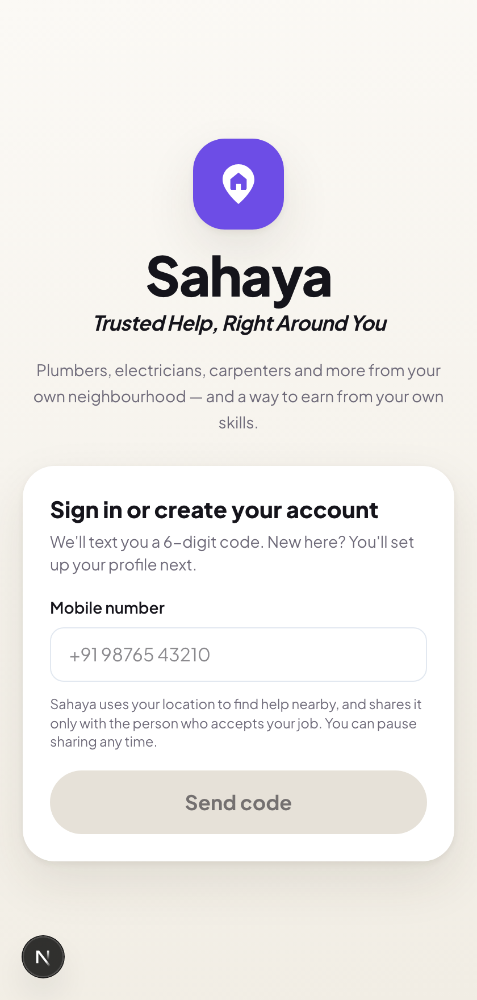
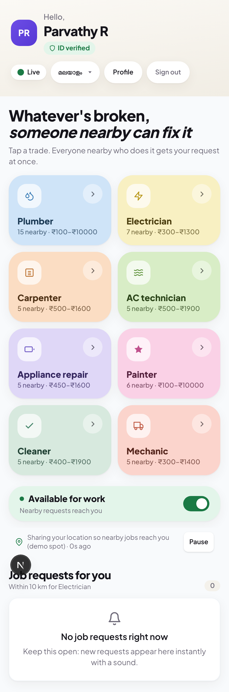
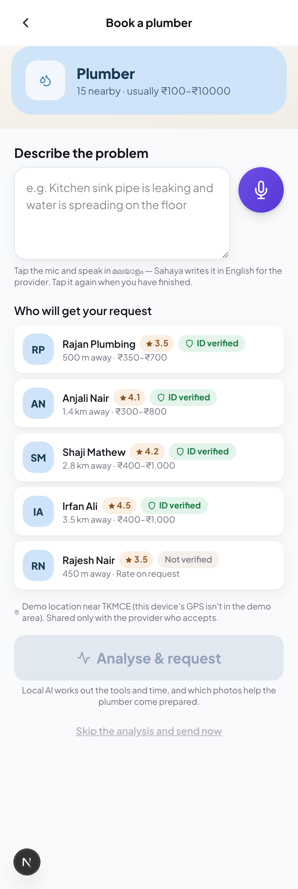
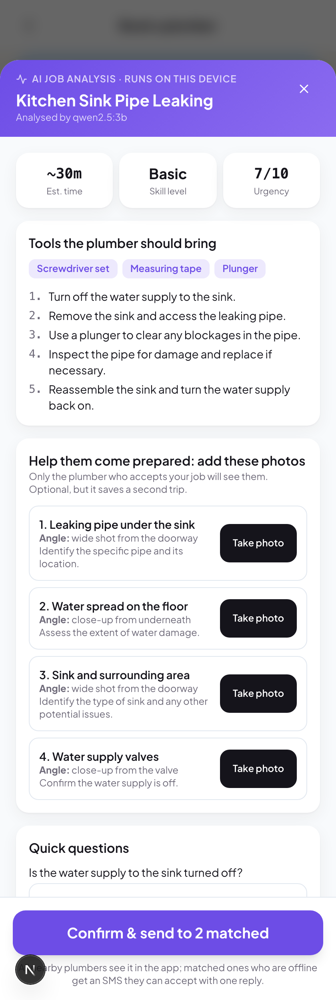
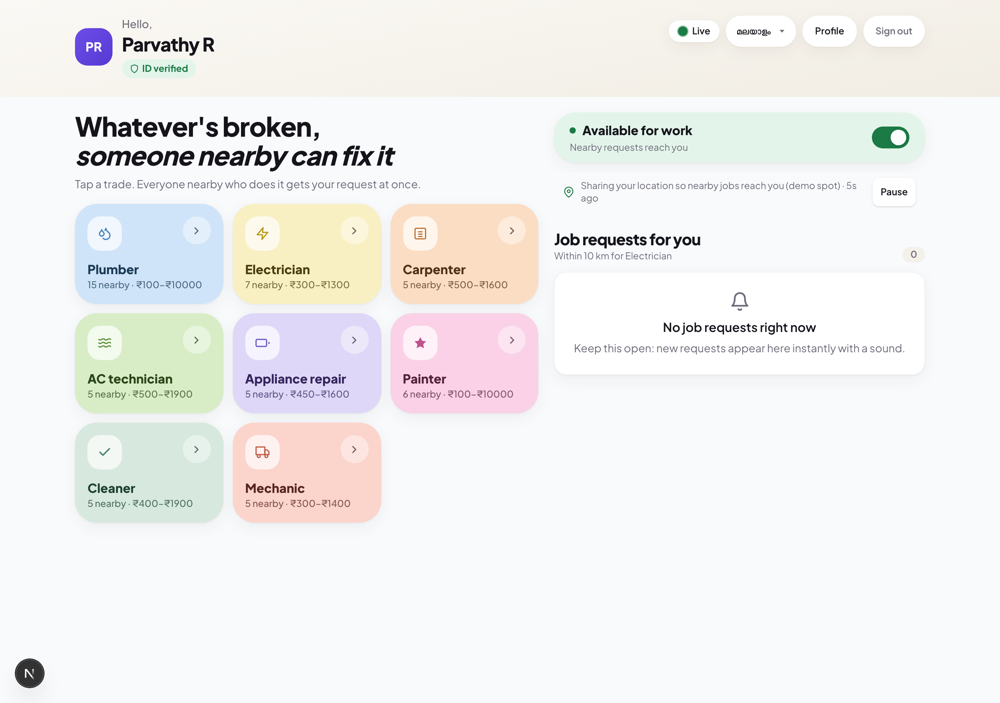

# Sahaya — Trusted Help, Right Around You

**Team Stochastic Thinkers · Kraft Night 2026 (IEDC TKMCE)**

> A community marketplace for local trades: plumbers, electricians, carpenters, AC technicians, appliance
> repairers, painters, cleaners and mechanics from your own neighbourhood. Like Uber, but for local professionals
> and skilled neighbours, so they earn directly from their skills.
>
> Built for Kraft Night 2026 (IEDC TKMCE).

---

## The problem

When a pipe bursts, a fuse trips or the AC dies in May, finding the right person nearby is slow and
uncertain. You ask around, call numbers from old WhatsApp forwards, and hope. You cannot see **who is available
right now**, **what they will charge**, or **whether they can be trusted**. Meanwhile the electrician two streets
away has free hours and no simple way to find local work on his own terms.

## What Sahaya does

**If you need help**
1. Tap a service and see how many providers are nearby and their price ranges.
2. Describe the problem by typing or speaking. A **local AI** reads it and works out the job: a title, the tools
   needed, how long it should take, the skill level, and **which photos to take, from which angle**, so the worker
   arrives prepared.
3. Matching providers within 10 km get it instantly. The first to accept gets the job.
4. You see their name, rating, ID-verified badge, phone, price range and **live position on a map**. Call or message
   them in a tap.
5. When it's done, pay (in-app payment is a placeholder for now) and rate them.

**If you offer a service**
- Pick your services, set **your own price range** for each, list the **tools you carry**, and upload an **ID proof**
  an admin verifies for a trust badge.
- Job requests for your services arrive live with a sound, with the customer's details and a map.
- **No app open? No missed work.** Matched providers who are offline get an SMS and claim the job with one reply:
  `ACCEPT 1234`. The app reacts exactly as if they had tapped Accept.
- One job at a time: while you're on a job your screen shows only that customer, with navigation; other requests wait.

**Admins** (`/ops`) get live requests on a map, **ID verification** (approve or reject with an SMS to the person),
team accounts and an audit log.

## What makes it different

| | Urban Company / Housejoy | JustDial / Sulekha | **Sahaya** |
|---|---|---|---|
| Who does the work | Company-curated staff | Lead lists | **Your own neighbours and local pros** |
| Pricing | Fixed company menu | Unknown until you call | **Each provider's own range, shown upfront** |
| Matching | Scheduled slots | You call around | **Live, within 10 km, by skill *and* tools** |
| Offline workers | Excluded | Miss the lead | **Get an SMS, accept with one reply** |
| Preparation | Worker arrives blind | — | **AI asks for photos and details first** |
| Commission | Significant cut | Pay per lead | **Providers keep what they earn** |

## Screenshots

| Sign in | Home: every trade nearby | Booking: who will get it | AI job analysis |
|---|---|---|---|
|  |  |  |  |

The same app on a laptop — one column becomes two, the trade grid goes three-up:



## Tech stack

| Layer | Choice |
|---|---|
| App | Next.js 16 (App Router), React 19, TypeScript (strict) |
| UI | Tailwind CSS 4, hand-built SVG map (no map library) |
| Live updates | Server-Sent Events (one snapshot per change) |
| Database | MongoDB (users, jobs, locations, audit log, GridFS for ID proofs and job photos) |
| Local AI | Ollama — `llama3.1`, falling back to `qwen2.5:3b`. Nothing leaves the machine |
| SMS | Twilio (Verify for sign-in codes, Messaging for job alerts and one-reply acceptance) |

No paid APIs, no cloud AI, no third-party map SDK.

---

## Run it yourself

### 1. Prerequisites

```bash
node --version      # 20+ (developed on 26)
mongod --version    # MongoDB 7+   → brew install mongodb-community
ollama --version    # https://ollama.com/download
```

### 2. Clone and install

```bash
git clone https://github.com/michaelharold/Sahaya.git
cd Sahaya
npm install
```

### 3. Start MongoDB and the local AI

```bash
mkdir -p ~/.local/mongodb-data
mongod --dbpath ~/.local/mongodb-data --bind_ip 127.0.0.1 --fork --logpath /tmp/mongod.log

ollama serve &            # if it is not already running
ollama pull llama3.1      # ~4.9 GB; qwen2.5:3b (~2 GB) also works and is much lighter
```

### 4. Configure

```bash
cp .env.example .env.local
```

Everything works out of the box **except real SMS**. The important settings:

| Setting | What it does |
|---|---|
| `MONGODB_URI` | `mongodb://127.0.0.1:27017` (blank falls back to a local JSON file) |
| `OLLAMA_SCOPE_MODEL` | `llama3.1`; falls back to `OLLAMA_MODEL` (`qwen2.5:3b`) automatically |
| `RESQ_SHOW_OTP_ON_SCREEN` | `1` shows sign-in codes on screen so you can demo without Twilio |
| `TWILIO_ACCOUNT_SID`, `TWILIO_API_KEY_SID`, `TWILIO_API_KEY_SECRET` | Twilio auth (API key recommended) |
| `TWILIO_VERIFY_SERVICE_SID` | Sends real sign-in codes (`VA…`) |
| `TWILIO_FROM` | A Twilio number; needed for job alerts and `ACCEPT` replies |
| `OPS_USER`, `OPS_PASSWORD` | Admin login (default `coordinator` / `resq-ops`) |

### 5. Run

```bash
npm run dev     # http://localhost:3000
npm test        # 90 unit tests
```

30 demo providers are created around TKMCE, Kollam on first start, with services, price ranges, tool kits and
verification badges.

### 6. Try it in 5 minutes

1. Open **http://localhost:3000/demo** and click **Open 4 users**. Each window is a separate person.
2. Sign each in with a different 10-digit number and the code shown on screen.
3. In one window pick **Plumber**, set a price range (₹350–₹700), tick the tools you carry, and stay **Available**.
4. In another window tap **Plumber**, describe *"the pipe under my kitchen sink is leaking"* and press
   **Analyse & request**. The AI lists the tools, time and photos to take; confirm and send.
5. The provider window beeps with the job. Accept it, and both sides get each other's details, a live map and
   navigation. Mark it done and rate.
6. **Offline acceptance:** in `/ops` → SMS log you'll see the alert text with a 4-digit code. Simulate the reply:
   ```bash
   curl localhost:3000/api/twilio/webhook -H 'x-ops-password: resq-ops' \
     --data-urlencode 'From=+919000000001' --data-urlencode 'Body=ACCEPT 1234'
   ```
   The job is assigned instantly and every other screen updates.
7. **Admin:** open `/ops` (`coordinator` / `resq-ops`) for live requests, ID verification and the audit log.

Phones on the same demo: `cloudflared tunnel --url http://localhost:3000` and open the HTTPS link (GPS and voice
input need HTTPS).

---

## How it fits together

```
app/
  page.tsx                     sign in → profile → home → book a service → live request
  ops/page.tsx                 admin: live requests, ID verification, team & audit
  api/
    scope-task/                AI scoping (preview) + open job & dispatch (confirm)
    twilio/webhook/            "ACCEPT 1234" from offline providers  → TwiML
    services/                  who is nearby, price ranges, provider lists
    dashboard/ + stream/       one live snapshot per person (SSE)
    requests/, jobs/, helpers/, me/, auth/, ops/
lib/
  scope.ts        local AI job breakdown (prompt, JSON schema, hand-written guard)
  matching.ts     $near within 10 km on skills + tools ($all → $in fallback)
  jobs.ts         MongoDB `jobs`: GeoJSON, 4-digit codes, status mirrored from the engine
  waves.ts        the request lifecycle: one accept wins, one job at a time
  store/          in-memory engine (atomic accept) + MongoDB persistence
  sms.ts, otp.ts, twilio.ts, files.ts, feed.ts, views.ts, events.ts, sse.ts
components/       UI: TaskScopeModal, JobBrief, ServiceRequestView, ActiveJob, LiveMap, …
docs/             WORKFLOW.md (how it works), UPGRADE.md, CONTRACTS.md
```

**Design note.** Accepting a job is decided in one place, under a per-request lock, so an in-app tap and an SMS
`ACCEPT` can never both win. MongoDB stores accounts, jobs, photos and the audit log; live request state is held in
memory (single process, by design) and mirrored to MongoDB on every change.

## Limitations (honest list)

- **In-app payment is a placeholder.** The flow ends at "Pay in app · coming soon".
- **Live request state is in memory**, so a server restart clears in-flight requests. Accounts, jobs, photos and
  logs survive in MongoDB.
- **Twilio trial accounts** can only text verified numbers; the app falls back to on-screen codes in demo mode.
- **ID verification is manual** and tiers are self-declared, pending real document checks.
- Single process by design: fine for a venue or a ward, not yet for a city.

## Roadmap

Help Credits (a neighbourhood time bank for small favours), neighbour vouching, tool lending between neighbours,
booking for family in another town, AI fair-price guidance from what neighbours actually paid, group bookings for a
building, and a community mode that turns the same network into a volunteer response during floods or landslides.
