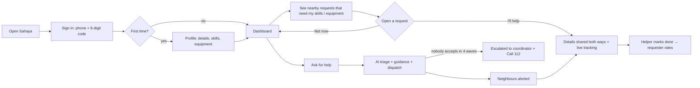
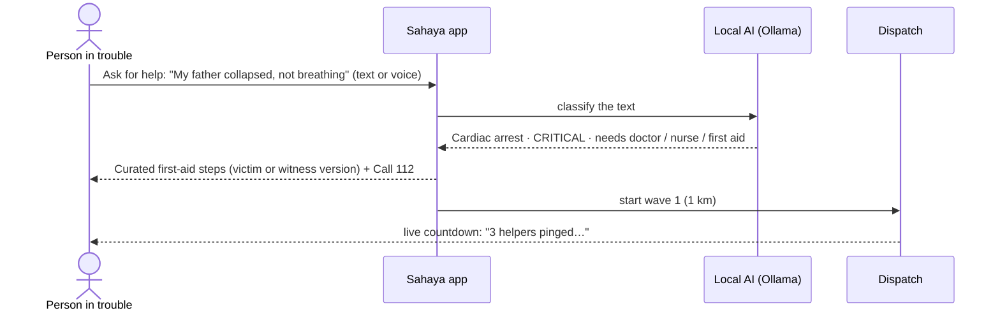
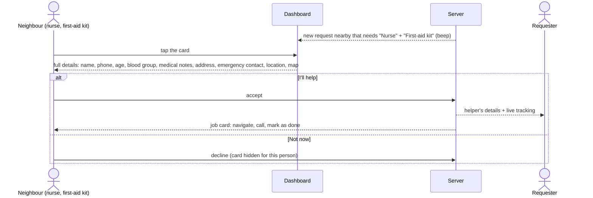

# Sahaya — how it works

One app for everyone at `/`, a coordinator console at `/ops`, and SMS for people without data.
This document describes the features that are built and working today.

---

## 1. The big picture

---

## 2. Every user: sign up once

| Step | Screen | What happens |
|---|---|---|
| 1 | Sign in | Enter mobile number → 6-digit code by SMS (shown on screen in demo mode) → verified. |
| 2 | Profile · details | Name, age, blood group, address, medical conditions / allergies, emergency contact. |
| 3 | Profile · skills & equipment | Skills (doctor, nurse, first aid, swimmer, electrician, plumber, counselor, volunteer) and equipment (boat, 4×4, generator, car, first-aid kit, oxygen cylinder, stretcher, rope/ladder, life jackets, water pump, cutter, torch, fire extinguisher). |
| 4 | Ready | "Available to help nearby" on/off → dashboard. |

From then on the app shares the user's location every 30 s (visible, pausable), so nearby requests reach them and authorities can find them in a declared disaster zone.

---

## 3. Asking for help

1. Tap **Ask for help**. Only one question: *what's happening?* (plus optional quick-pick and "Me / Someone with me").
2. Name, phone, age, blood group, medical notes and GPS location are attached **from the profile**.
3. The local AI decides the emergency type, urgency and skills needed. If it is slow or unsure, keyword rules decide.
4. The screen immediately shows **curated first-aid steps** (Red Cross / WHO wording, never AI-written). It uses the victim version for "Me" and the witness version for "Someone with me".
5. Dispatch pings the 3 best-matched neighbours within **1 km**. If nobody accepts in 30 s, it widens to **2 → 4 → 8 km**. After 4 waves the request is **escalated** to the coordinator and the user is told to call 112.
6. When someone accepts, the requester sees the helper's **name, phone, skills, equipment**, their **live position** on a map, an ETA, and "Arrived".

---

## 4. Helping someone

- **People near you who need help** lists open requests within 10 km that match your skills **or** equipment, with "Needs your: Nurse · First-aid kit". It updates live and beeps on new ones.
- A red **"You were picked · 24s"** badge means dispatch chose you in the current wave.
- The first person to accept gets the job. Anyone else who tries is told it is taken.
- While helping, your position is sent every 3 s so the requester sees you approach. On a laptop the demo simulates the trip.
- **Mark as done** closes the request. The requester rates the helper, which updates their reliability score and future ranking.

---

## 5. Authorities (`/ops`)

| Tab | Use |
|---|---|
| **Live dispatch** | Map of helpers and open requests, escalations flagged (SMS-in, no location), coverage by skill, dispatch table per request, SMS log, simulate inbound SMS, demo controls. |
| **Disaster zones** | Click the map to declare a zone (landslide, flood, fire, …) and set its radius. The panel lists everyone **in it now or in it during the previous 6 h**, with name, phone, lat/lng, accuracy and last update. Actions: **Call**, **Open in Maps**, **Export CSV**, **SMS everyone in the zone**. |
| **Team & audit** | Admins add officer accounts. Every login, zone, location view and alert is logged. |

Login is username + password (default `coordinator` / `resq-ops`).

---

## 6. No mobile data: SMS

| Text to the Sahaya number | Result |
|---|---|
| `HELP trapped near TKMCE hostel` | Creates a request placed at the named landmark and dispatches helpers. Without a known place it goes straight to the coordinator. |
| `YES` | A pinged helper accepts their newest request and gets a maps link and the requester's phone. |
| `NO` | Declines. The next wave goes out immediately once all pinged helpers have declined. |

Without Twilio credentials, SMS is simulated and shown in the coordinator's SMS log.

---

## 7. Demo run (5 minutes, one laptop)

1. Open `/demo` → **Open 4 users**. Each window is a separate person.
2. Sign each window in with a different number (e.g. `9876500001` … `04`) using the on-screen code.
3. Profiles:
   - **Window 1:** Anil, 62, B+, diabetic.
   - **Window 2:** Nurse with a first-aid kit.
   - **Window 3:** Swimmer with a boat.
   - **Window 4:** Doctor.
4. Window 1 → **Ask for help** → *"My father collapsed and is not breathing"* → guidance and countdown appear.
5. Windows 2 and 4 beep (their skills match). Window 3 does not (no match).
6. Window 2 opens the card, reads Anil's medical notes, taps **I'll help**. Window 1 now shows the nurse's name, phone and live position moving closer.
7. Window 4 tries to accept and is told it is already taken.
8. Window 2 → **Mark as done** → Window 1 rates 5★.
9. `/ops` → **Disaster zones** → click near TKMCE, 800 m, "Karicode landslide" → everyone inside is listed with lat/lng → **Send alert**.
